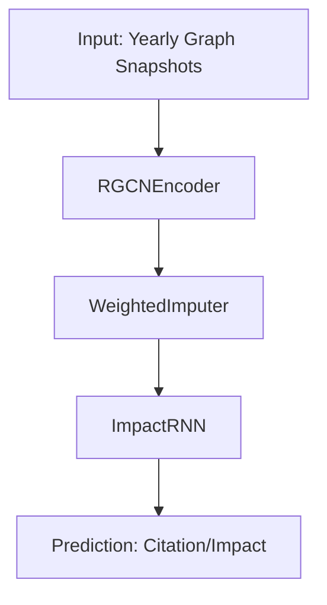

# TeamingEvaluator Model Overview

This document describes the architecture and workflow of the **ImpactModel** and its supporting modules in the `GNNteamingEvaluator/TeamingEvaluator/models` directory. The model is designed for temporal graph-based prediction tasks, such as forecasting paper citations or evaluating team impact in academic networks.

---

## High-Level Architecture

---

## Module Descriptions

### 1. `rgcn_encoder.py` — **RGCNEncoder**
- **Purpose:** Encodes each yearly heterogeneous graph snapshot using a relation-aware Graph Convolutional Network (RGCN).
- **Details:**
  - Projects node features to a shared hidden dimension.
  - Applies multiple layers of message passing (using SAGEConv) for each edge type.
  - Uses batch normalization and dropout for stability.
  - Outputs node embeddings for each type (author, paper, venue, etc.).

### 2. `imputer.py` — **WeightedImputer**
- **Purpose:** Imputes (constructs) a paper embedding for each year by aggregating its neighbors' embeddings (authors, venue, references) and its own topic vector.
- **Details:**
  - Learns a scalar weight for each metadata type (author, venue, paper, self).
  - Aggregates author embeddings using an attention mechanism.
  - Normalizes and combines all parts to produce the imputed embedding for a paper in a given year.

### 3. `impact_rnn.py` — **ImpactRNN**
- **Purpose:** Models the temporal evolution of a paper/team's embedding sequence using a GRU, and predicts future impact (e.g., citations) over multiple horizons.
- **Details:**
  - Takes a sequence of imputed embeddings (e.g., for 6 years) as input.
  - Encodes the sequence with a GRU and layer normalization.
  - Three MLP heads output parameters (η, μ, σ) for a cumulative citation prediction function.
  - Predicts cumulative and yearly impact using a parameterized function of time.

### 4. `full_model.py` — **ImpactModel**
- **Purpose:** Integrates the encoder, imputer, and RNN into a single model for end-to-end training and evaluation.
- **Workflow:**
  1. **Encoding:** Each yearly snapshot is encoded with `RGCNEncoder`.
  2. **Imputation:** For each paper, a sequence of embeddings is constructed using `WeightedImputer` (aggregating neighbors and topic vectors for the current and previous years).
  3. **Temporal Modeling:** The sequence is passed to `ImpactRNN` to predict future impact.
  4. **Loss:** Combines prediction loss and (optionally) a temporal smoothing regularizer.
  5. **Evaluation:** Supports both standard and counterfactual (team-based) evaluation modes.

### 5. `train.py` — **Training & Evaluation Pipeline**
- **Purpose:** Orchestrates data loading, model training, evaluation, checkpointing, and logging.
- **Key Features:**
  - Loads yearly graph snapshots and prepares training/testing splits.
  - Configures and instantiates the `ImpactModel`.
  - Supports cold-start augmentation and various ablation modes (e.g., dropping authors).
  - Trains the model with early stopping, learning rate scheduling, and gradient clipping.
  - Evaluates the model in both paper-level and team-level (counterfactual) settings.
  - Saves checkpoints and logs metrics for each epoch.

---

## Workflow Summary

1. **Data Preparation:**
   - Yearly graph snapshots are loaded, each containing heterogeneous nodes (authors, papers, venues) and edges (writes, cites, published_in).

2. **Encoding:**
   - Each snapshot is encoded using `RGCNEncoder` to produce node embeddings.

3. **Imputation:**
   - For each paper in the training/test set, a sequence of embeddings is constructed for the current and previous years using `WeightedImputer`.

4. **Temporal Modeling:**
   - The sequence is passed to `ImpactRNN`, which outputs parameters for a cumulative impact prediction function.
   - The model predicts yearly and cumulative impact (e.g., citations) for each paper/team.

5. **Loss & Optimization:**
   - The main loss is the mean squared error between log-transformed true and predicted impact.
   - Optionally, a temporal smoothing regularizer penalizes large changes in embeddings across consecutive years.
   - The model is trained with AdamW, learning rate scheduling, and early stopping.

6. **Evaluation:**
   - Standard evaluation: Predicts impact for real papers.
   - Team/counterfactual evaluation: Predicts impact for hypothetical teams (with ablation options for author composition).

---

## Key Classes and Functions

- **ImpactModel** (full_model.py): Main model class integrating all modules.
- **RGCNEncoder** (rgcn_encoder.py): Encodes graph snapshots.
- **WeightedImputer** (imputer.py): Aggregates neighbor embeddings.
- **ImpactRNN** (impact_rnn.py): Models temporal sequences and predicts impact.
- **train.py**: Training and evaluation script.

---

## References
- The architecture is inspired by recent work on temporal graph neural networks and counterfactual team evaluation in academic networks.
- For more details, see the code comments in each module. 